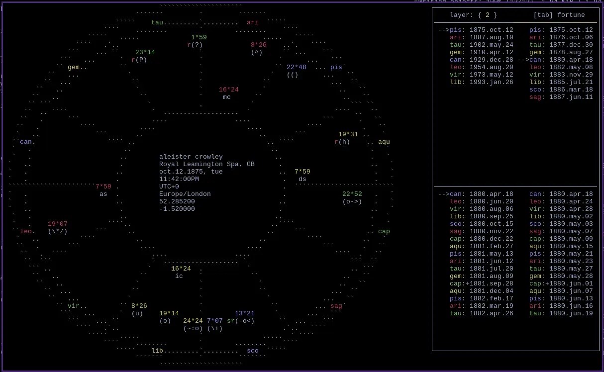

% zodiacal releasing
% yam
% 22 September 2026
  
now easily calculated by astro
---

  

opens on the right side of the screen, instantly upon pressing z! in smaller resolutions it pushes aside the data panels to focus the chart. its often bothered me how many softwares would cover the chart or not show it at all. I find it easier to read with both open. 

can change layer with the number keys or by pressing h/l, the bar above will be colored to make it pain which layer is selected. the time is calculated from the current charts timezone. loosing of the bond is shown with a +. choose which lot to release from by pressing tab. 

---

